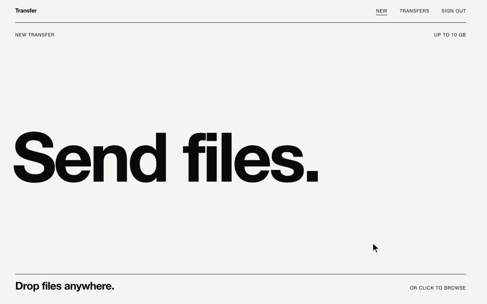
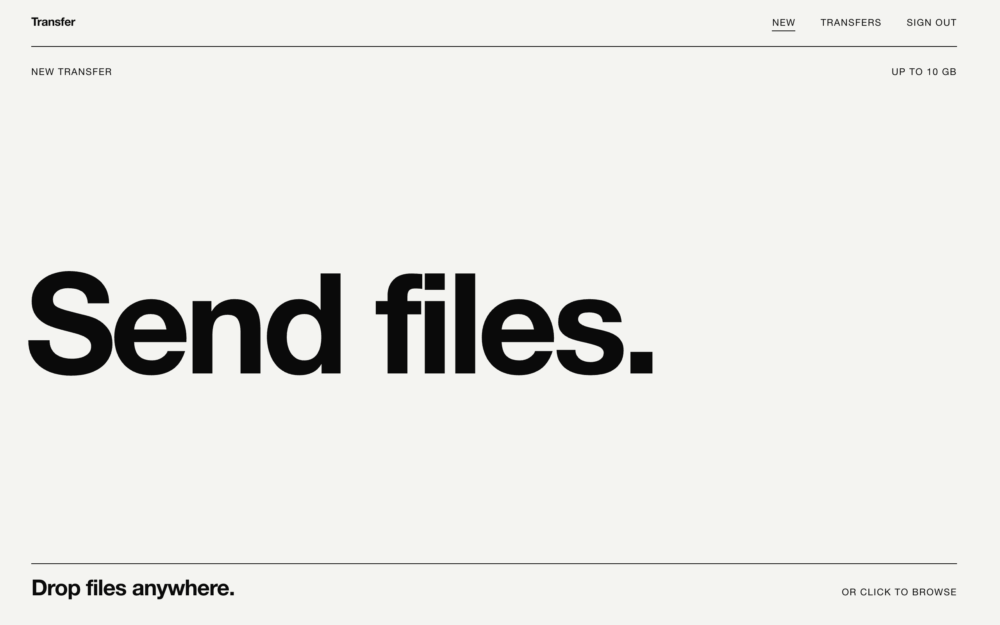
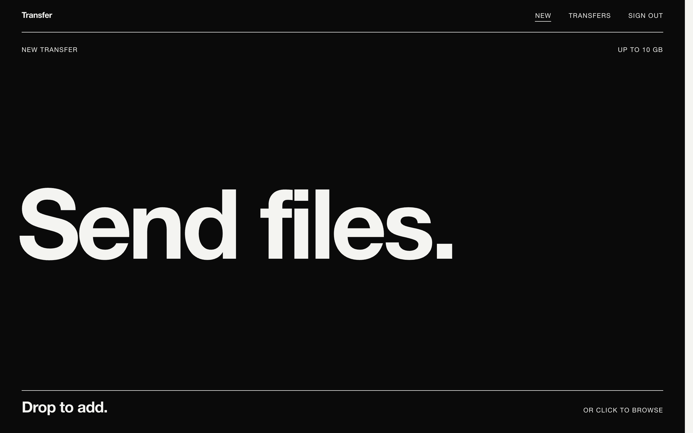
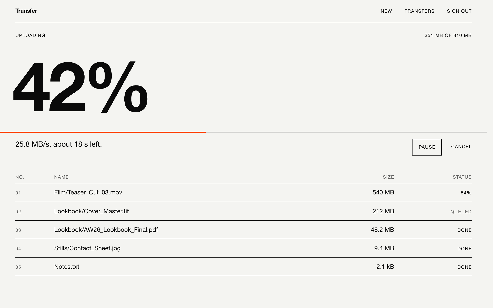
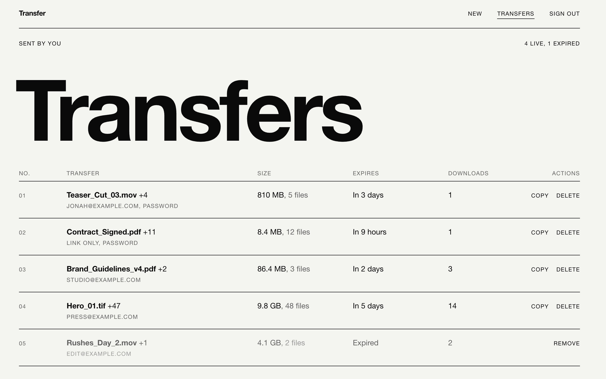
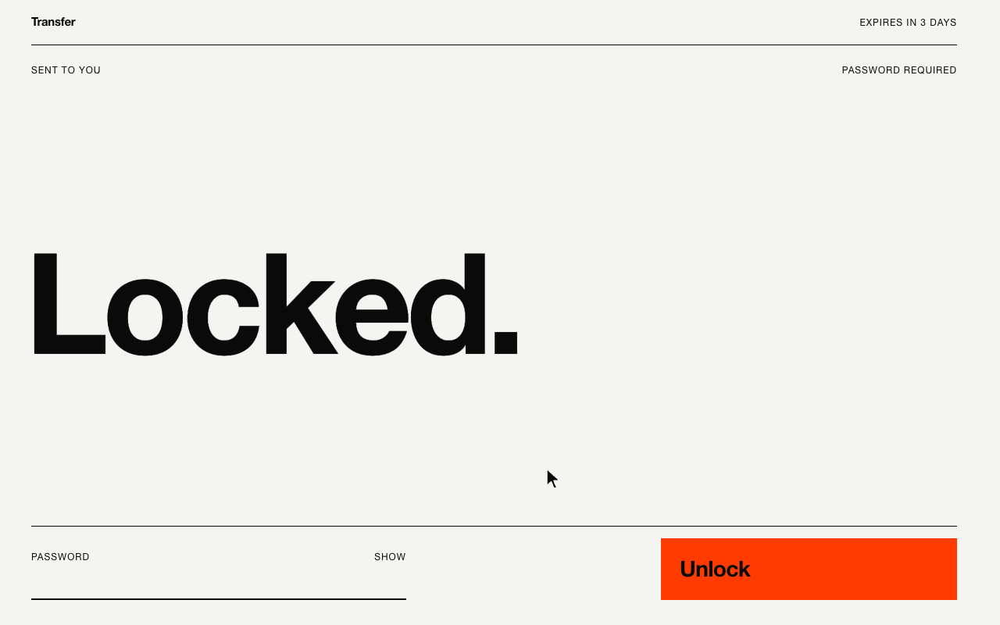
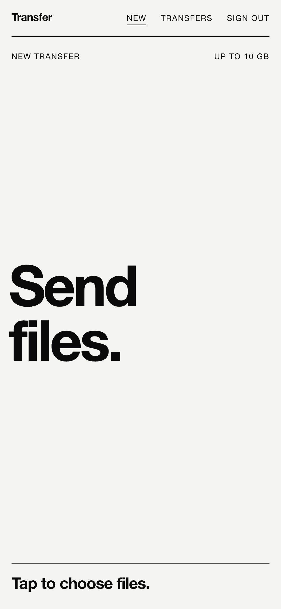
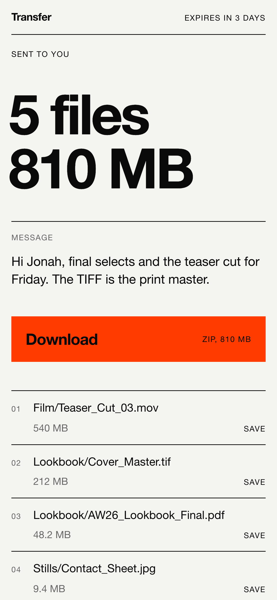
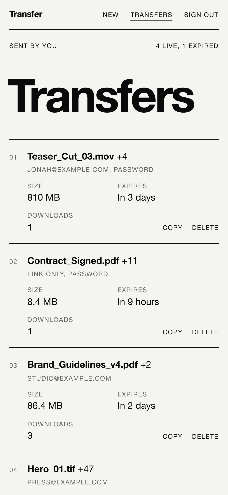

# Transfer

A private, self-hosted alternative to WeTransfer. You are the only uploader.
Recipients get a link and need no account, and the files sit in your own
storage until they expire.

  
  

  
  

## What the recipient sees

## On a phone

  
  
  

Recorded with demo data against a local stand-in for the storage, so the speeds shown are illustrative.

## What it does

- Uploads go straight from the browser to Cloudflare R2 in parallel parts
  that pause, resume and retry. Up to 10 GB per transfer.
- Each transfer gets an unguessable link, with an optional message,
  password and email to the recipient.
- Recipients save single files, or everything as one zip built in their
  browser.
- Transfers expire after 1, 3 or 7 days, and a daily job deletes the files.
- You are emailed the first time a transfer is downloaded, and a dashboard
  lists everything you have sent.

## Built with

Next.js, TypeScript, Tailwind CSS, Supabase, Cloudflare R2, Uppy, Resend and
Motion. Deploys to Vercel.

## Run your own

[SETUP.md](SETUP.md) covers every step for Supabase, Cloudflare R2, Resend
and Vercel, and explains how the app is secured.

## Licence

[MIT](LICENSE)
